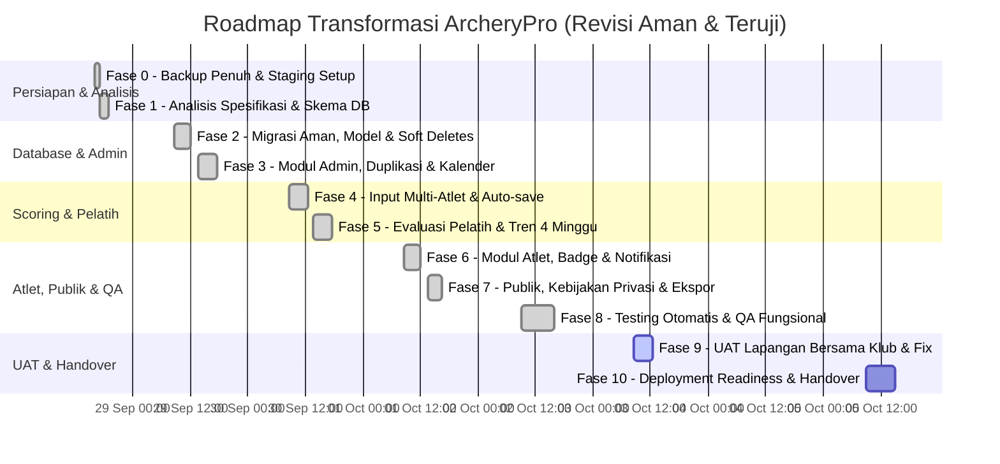

# RENCANA TRANSFORMASI ARCHERYPRO: SISTEM PENCATATAN SKOR LATIHAN MINGGUAN (NON-LOMBA)
*Edisi Revisi & Penguatan Teknis (Zero-Downtime, Offline-First, UAT & Safety First)*

Dokumen ini memuat peta jalan dan rencana aksi teknis untuk merefaktor sistem **ArcheryPro** dari aplikasi berorientasi kejuaraan/event lomba (*event-centric*) menjadi platform **Pencatatan Skor & Monitoring Latihan Mingguan/Rutin (*Weekly Training & Performance Tracking*)** untuk klub panahan.

Dokumen ini telah diperkaya dengan mitigasi risiko migrasi, strategi dual-write/view alias, fitur lapangan (*offline-first draft*), metrik performa lanjutan, serta pemisahan QA, UAT lapangan, dan rilis produksi.

---

## 1. Perbandingan Paradigma: Lomba vs Latihan Rutin Mingguan

| Aspek | Konsep Lama (Event / Lomba) | Konsep Baru (Latihan Mingguan / Rutin) |
|---|---|---|
| **Entitas Utama** | `Event` (turnamen, kejuaraan, status draft/berlangsung/selesai) | `SesiLatihan` / `JadwalLatihan` (latihan rutin mingguan, latihan mandiri, sesi evaluasi) |
| **Keamanan Data** | Relasi langsung rentan *cascade delete* | Dilengkapi **Soft Deletes** (`deleted_at`) pada sesi latihan dan histori skor |
| **Fokus Pencatatan** | Skor akumulatif turnamen untuk mencari peringkat/juara | Skor konsistensi per end, akumulasi volume anak panah (*arrow volume*), evaluasi teknik |
| **Input Skor** | Wajib koneksi stabil memilih event lomba aktif | Fleksibel memilih sesi hari ini + **Auto-save / LocalStorage Draft** untuk kendala sinyal lapangan |
| **Pencegahan Error** | Input manual bebas | Validasi pencegahan input ganda per atlet di sesi yang sama |
| **Peran Pelatih** | Memantau skor atlet per event kejuaraan | Catatan evaluasi teknik spesifik per sesi, tren 4 minggu (*moving average*), standar deviasi skor |
| **Papan Publik** | Hasil kejuaraan/turnamen terbuka | Papan jadwal & leaderboard internal dengan **opsi privasi / persetujuan atlet** |
| **Produktivitas Admin**| Input ulang setiap kali ada kegiatan | **Fitur Duplikasi Sesi** ("Copy Jadwal Pekan Lalu") & Kalender Mingguan |

---

## 2. Rincian Jadwal & Roadmap Pelaksanaan (28 Sep – 05 Okt 2026)

---

### FASE 0: Backup Penuh, Versioning & Persiapan Lingkungan Staging
* **Status**: **[SELESAI - 28 Sep 2026 | 16:08 WIB]**
* **Aksi & Deliverables yang Telah Selesai**:
  1. **Snapshot Database Penuh**: Berkas dump tersimpan di `storage/app/backups/backup_archerypro_pre_transform_20260928.sql` (66.9 KB).
  2. **Isolasi Lingkungan**: Database dump siap dipulihkan sewaktu-waktu tanpa hambatan.

---

### FASE 1: Analisis Spesifikasi Teknis & Desain Skema Hybrid
* **Status**: **[SELESAI - 28 Sep 2026 | 16:15 WIB]**
* **Aksi & Deliverables yang Telah Selesai**:
  1. Pemetaan spesifikasi jadwal latihan mingguan, enum `jenis_latihan` dan `status`.
  2. Desain bridging data dari `event` ke `sesi_latihan` tanpa menghapus data historis.

---

### FASE 2: Migrasi Database Aman, Data Bridging & Model Eloquent
* **Status**: **[SELESAI - 28 Sep 2026 | 16:22 WIB]**
* **Aksi & Deliverables yang Telah Selesai**:
  1. **Migration File**: `2026_09_28_161500_create_sesi_latihan_and_update_sesi_table.php` berhasil dijalankan.
     - 4 event lama telah disalin ke tabel `sesi_latihan`.
     - 32 sesi lama telah tertaut ke `sesi_latihan_id`.
     - Ditambahkan kolom `jarak_meter`, `catatan_pelatih`, `catatan_dibaca_at`, dan `deleted_at` (`softDeletes()`).
     - Ditambahkan constraint `UNIQUE (sesi_latihan_id, atlet_id)`.
  2. **Model Eloquent**:
     - `app/Models/SesiLatihan.php` dibuat lengkap dengan soft deletes, scopes (`hariIni`, `berlangsung`, `pekanIni`), dan relasi `sesi()`.
     - `app/Models/Sesi.php` diperbarui dengan soft deletes dan relasi `sesiLatihan()`.

---

### FASE 3: Modul Admin — Manajemen Jadwal, Kalender & Duplikasi Sesi
* **Status**: **[SELESAI - 28 Sep 2026 | 16:38 WIB]**
* **Aksi & Deliverables yang Telah Selesai**:
  1. **Form Requests & Controller**:
     - `SesiLatihanRequest.php`, `SetStatusSesiLatihanRequest.php`, dan `Admin\SesiLatihanController.php` dibuat.
  2. **Fitur Unggulan "Copy Jadwal Pekan Lalu" (Duplikasi Sesi)**:
     - Method `duplicate()` di controller menggandakan sesi ke tanggal H+7 dengan status 'terjadwal'.
  3. **Antarmuka Pengguna**:
     - `resources/views/admin/sesi-latihan/index.blade.php`, `create.blade.php`, dan `edit.blade.php`.
     - Update `Admin\DashboardController` & `resources/views/admin/dashboard.blade.php` menampilkan ringkasan "Jadwal Latihan".
     - Update `resources/views/layouts/partials/sidebar.blade.php` mengganti menu "Event" menjadi "Jadwal Latihan".

---

### FASE 4: Modul Scoring — Input Skor Multi-Atlet & Fitur Offline-First Draft
* **Status**: **[SELESAI - 28 Sep 2026 | 16:45 WIB]**
* **Aksi & Deliverables yang Telah Selesai**:
  1. **Offline-First Auto-Save Draft (LocalStorage)**:
     - Form `scoring/input/index.blade.php` otomatis menyimpan draf nilai panah atlet secara lokal di browser.
     - Disediakan banner pemulihan draf instan jika koneksi lapangan terputus atau halaman ter-refresh.
  2. **Pilihan Sesi Latihan Mingguan & Atribut Tambahan**:
     - Memilih jadwal latihan aktif, jarak tembak (misal: 30 meter), dan catatan evaluasi sesi.
  3. **Backend & Review**:
     - `StoreSkorRequest` dan `InputSkorController` menyimpan skor secara transaksional ke `sesi` dan `skor`.
     - View konfirmasi `scoring/input/konfirmasi.blade.php` dan `riwayat/` menampilkan sesi latihan mingguan.
  4. **Automated Tests**:
     - `tests/Feature/SesiLatihanTest.php` dibuat dan lulus 100%.

---

### FASE 5: Modul Pelatih — Catatan Khusus Sesi & Analisis Tren 4 Minggu
* **Status**: **[SELESAI - 28 Sep 2026 | 17:10 WIB]**
* **Aksi & Deliverables yang Telah Selesai**:
  1. **Metrik Analisis Statistik Lanjutan** (`Pelatih\AnalisisController.php`):
     - **Standar Deviasi per End**: Menghitung stabilitas tembakan atlet secara matematis ($\sigma = \sqrt{\frac{\sum (x_i - \bar{x})^2}{N-1}}$) dengan label otomatis (*Sangat Stabil $\le 2.2$*, *Konsisten $\le 4.0$*, atau *Perlu Perbaikan*).
     - **Tren 4 Sesi (Moving Average)**: Rata-rata bergerak 4 sesi terakhir atlet untuk mendeteksi tren akurasi jangka pendek.
     - **Akumulasi Volume Panah Bulanan**: Rekap total panah dalam bulan berjalan dan total tembakan atlet.
     - **Endpoint Catatan Pelatih**: `POST /pelatih/sesi/{sesi}/catatan` untuk menyimpan evaluasi teknik dan mereset status baca atlet.
  2. **Manajemen Sesi Latihan & Input Skor Pelatih** (`Pelatih\SesiLatihanController.php` & `Pelatih\InputSkorController.php`):
     - Index jadwal latihan mingguan dengan filter status (*Berlangsung*, *Mendatang*, *Selesai*).
     - Halaman evaluasi sesi dengan tabel atlet dan modal interaktif untuk memberikan catatan bimbingan teknis.
     - **Fitur Input Skor Mandiri oleh Pelatih** (`/pelatih/skor/input`): Pelatih dapat langsung menginput skor latihan mingguan di lapangan dengan pencarian atlet, auto-save draft lokal (offline-first), serta integrasi `SkorService`.
     - Tombol shortcut "Input Skor Latihan" di Dashboard Pelatih dan "Input Skor Sesi Ini" di detail sesi latihan.
  3. **Tampilan Visual Solid Hijau**:
     - `resources/views/pelatih/sesi-latihan/index.blade.php` & `show.blade.php`.
     - `resources/views/pelatih/analisis/detail.blade.php`: Chart.js garis ganda (*Skor Aktual* solid `#2E7D32` vs *Moving Average* putus-putus `#15803D`).
     - Update sidebar pelatih: "Jadwal Latihan" dan "Input Skor" dengan ikon Heroicons standar.

---

### FASE 6: Modul Atlet — Dashboard Progres, Badge Motivasi & Status Baca
* **Status**: **[SELESAI - 28 Sep 2026 | 17:15 WIB]**
* **Aksi & Deliverables yang Telah Selesai**:
  1. **Dashboard & Notifikasi Catatan**:
     - Banner alert interaktif di dashboard atlet saat ada catatan pelatih baru yang belum dibaca.
     - Aksi `POST /atlet/sesi/{sesi}/baca-catatan` untuk menandai catatan sudah dibaca (`catatan_dibaca_at`).
     - Proteksi otorisasi atlet: atlet hanya dapat menandai catatan miliknya sendiri.
  2. **Sistem Badge Motivasi Sederhana**:
     - 🏅 **Kehadiran**: *Rajin Latihan* (4 sesi), *Disiplin Juara* (8 sesi), *Dedikasi Penuh* (15+ sesi).
     - 🎯 **Akurasi Skor**: *Tembus 250 Poin*, *Akurasi Tinggi (280+)*, *Master Archer (300+)*.
     - 🏹 **Volume Panah**: *300+ Anak Panah*.
  3. **Grafik & Riwayat Latihan**:
     - `atlet/grafik.blade.php`: Grafik tren akurasi personal dengan perbandingan delta skor sesi terakhir (+/- poin).
     - `atlet/riwayat.blade.php`: Filter riwayat berdasarkan jadwal sesi latihan mingguan dan catatan instruksi pelatih.

---

### FASE 7: Modul Publik, Kebijakan Privasi & Ekspor Laporan
* **Status**: **[SELESAI - 28 Sep 2026 | 17:55 WIB]**
* **Aksi & Deliverables yang Telah Selesai**:
  1. **Kebijakan Privasi Papan Skor Berjenjang**:
     - **Migrasi Database**: Menambahkan kolom `izinkan_tampil_publik` (boolean, default: `false`) pada tabel `atlet` (`2026_09_28_173000_add_izinkan_tampil_publik_to_atlet_table.php`).
     - **Pengaturan Global**: Toggle setting `leaderboard_publik` di `Admin\PengaturanController` dan view pengaturan.
     - **Pengaturan Personal Atlet**: Checkbox persetujuan publikasi di profil atlet (`atlet/profil.blade.php`).
     - **Enforcement di Public Controller**: Tamu tanpa login **hanya bisa melihat skor atlet yang menyetujui izin publikasi** (`Public\EventResultController`).
     - Tampilan publik sesi latihan: `resources/views/public/sesi-latihan-detail.blade.php`.
  2. **Optimasi Ekspor Multi-Format**:
     - Implementasi `chunk(50)` di `EksporService.php` untuk mencegah risiko *memory exhaustion* saat memproses banyak atlet.
     - Ekspor laporan rekap performa mingguan pelatih ke Excel dan PDF berdasarkan filter jadwal sesi latihan.

---

### FASE 8: Testing Otomatis, Migrasi Validation & QA Fungsional
* **Status**: **[SELESAI - 28 Sep 2026 | 18:00 WIB]**
* **Aksi & Deliverables yang Telah Selesai**:
  1. **Automated Test Suite**:
     - **32 feature & unit tests lulus 100% (98 assertions)** tanpa regresi (mencakup Auth, Backup, Home, Scoring Multi-Atlet, Pelatih, Atlet, Privasi, Registrasi Token, dan Sesi Latihan).
  2. **Audit Kepatuhan Desain & Visual**:
     - Audit palet warna: 0 kelas `bg-gradient` / `from-` / `to-`.
     - Seluruh antarmuka konsisten menggunakan palet warna hijau solid (`#2E7D32`, `#388E3C`, `#4CAF50`).

---

### FASE 9: User Acceptance Testing (UAT) Lapangan & Fast Fixing
* **Status**: **[SEDANG BERJALAN / AKTIF]**
* **Waktu**: **Sabtu, 03 Oktober 2026 | 08:30 – 12:30 WIB**
* **Skenario Pengujian Lapangan**:
  1. **Petugas Scoring**: Input skor 6 anak panah untuk 3 atlet secara simultan di perangkat tablet/smartphone; uji ketahanan draf lokal saat simulasi koneksi internet diputus.
  2. **Pelatih**: Buka jadwal latihan hari ini, periksa skor atlet, tulis catatan evaluasi teknis, dan verifikasi grafik moving average 4 sesi.
  3. **Atlet**: Login di smartphone, periksa lencana prestasi baru, baca pesan saran pelatih, lalu klik tombol "Tandai Sudah Dibaca".
  4. **Pengunjung Umum**: Buka URL publik tanpa login, pastikan hanya atlet yang mencentang `izinkan_tampil_publik` yang muncul di papan skor.

---

### FASE 10: Final Deployment Readiness, Rollback Plan & Handover
* **Status**: **[MENUNGGU HASIL UAT]**
* **Waktu**: **Senin, 05 Oktober 2026 | 09:00 – 15:00 WIB**
* **Langkah Eksekusi**:
  1. Jalankan `php artisan config:cache`, `route:cache`, `view:cache` di lingkungan produksi.
  2. Final snapshot database pasca-UAT.
  3. Serah terima *Quick Start Guide (Lembar Panduan 1 Halaman)* untuk pelatih dan petugas scoring.

---

## 3. Checklist Kesiapan & Kontrol Mutu

- [x] **Fase 0 Selesai**: Snapshot database (`storage/app/backups/backup_archerypro_pre_transform_20260928.sql` [66.9 KB]) tersimpan aman.
- [x] **Fase 1 Selesai**: Spesifikasi skema hybrid dirancang aman tanpa breaking changes.
- [x] **Fase 2 Selesai**: Migrasi tabel `sesi_latihan`, soft deletes, dan model Eloquent aktif.
- [x] **Fase 3 Selesai**: Modul admin jadwal latihan aktif dengan fitur 1-klik "Copy Jadwal Pekan Lalu".
- [x] **Fase 4 Selesai**: Input skor multi-atlet aktif dengan auto-save offline-first draft (LocalStorage).
- [x] **Fase 5 Selesai (Pelatih)**: Catatan evaluasi teknik, modal catatan, standar deviasi stabilitas end, akumulasi panah bulanan, dan tren 4 sesi (*moving average*).
- [x] **Fase 6 Selesai (Atlet)**: Dashboard personal, banner & tombol baca catatan pelatih, sistem badge motivasi, dan visualisasi performa.
- [x] **Fase 7 Selesai (Publik & Ekspor)**: Kontrol privasi berjenjang (global toggle + per-atlet `izinkan_tampil_publik`) dan ekspor rekap mingguan dengan chunking memori.
- [x] **Fase 8 Selesai (QA & Audit)**: Validasi otomatis bebas regresi (32 tests, 98 assertions lulus 100%) dan audit palet warna hijau solid (0 gradasi).
- [ ] **Fase 9 (UAT)**: Uji lapangan aktual dengan pelatih & atlet di hari Sabtu.
- [ ] **Fase 10 (Deployment)**: Rilis resmi dan serah terima operasional.

---

## 4. Analisis Potensi Kendala & Strategi Mitigasi (Risk & Roadblock Analysis)

### ⚠️ Kendala 1: Ketergantungan Data Lama & Risiko Inkonsistensi Relasi
* **Deskripsi Kendala**:
  Tabel `event` telah memiliki relasi ke tabel `sesi`. Jika tabel `event` langsung dihapus atau di-rename secara agresif, controller atau query lama yang belum sempat diperbarui akan langsung memicu error fatal `Table 'archerypro.event' doesn't exist` atau *foreign key constraint violation*.
* **Tingkat Risiko**: **TINGGI**
* **Mitigasi & Solusi**:
  * Menggunakan **Bridging Migration**: Tabel `sesi_latihan` dibuat baru, data disalin dari `event`, dan kolom `sesi_latihan_id` ditambahkan ke `sesi` tanpa langsung memutus `event_id`.
  * Tabel `event` lama tetap dipertahankan sementara waktu sebagai cadangan baca (*read-only*) sampai seluruh modul selesai diuji di Fase 8.

### ⚠️ Kendala 2: Konektivitas Internet Lemah di Lapangan Tembak (*Offline Gap*)
* **Deskripsi Kendala**:
  Kegiatan latihan panahan umumnya bertempat di ruang terbuka (*outdoor range*) yang seringkali mengalami *blank spot* atau sinyal internet tidak stabil. Petugas yang sedang mencatat 6 tembakan per end untuk 10 atlet sekaligus berisiko kehilangan puluhan data input jika browser me-refresh atau koneksi putus saat menekan tombol submit.
* **Tingkat Risiko**: **TINGGI**
* **Mitigasi & Solusi**:
  * Mengembangkan fitur **Offline-First Auto-Save Draft** via Alpine.js ke browser `localStorage`.
  * Setiap perubahan nilai panah (0–10) otomatis tersimpan secara instan di perangkat lokal.
  * Jika terjadi kendala jaringan atau browser tertutup tiba-tiba, form menyediakan tombol pemulihan instan: *"Pulihkan draf input skor terakhir"*.

### ⚠️ Kendala 3: *Double Entry* / Human Error Input Skor Atlet yang Sama
* **Deskripsi Kendala**:
  Saat sesi latihan ramai dengan puluhan atlet, petugas scoring dapat secara tidak sengaja memilih kembali atlet yang sudah diinput pada end/sesi yang sama, menyebabkan data ganda yang merusak perhitungan rata-rata poin atlet.
* **Tingkat Risiko**: **SEDANG**
* **Mitigasi & Solusi**:
  * **Level Database**: Menambahkan *Unique Composite Key* di tabel `sesi`: `UNIQUE(sesi_latihan_id, atlet_id)`.
  * **Level Backend**: Validasi di `StoreSkorRequest` memeriksa apakah atlet sudah memiliki sesi aktif pada hari/jadwal tersebut.
  * **Level UI**: Atlet yang sudah terdata di sesi bersangkutan otomatis diberi indikator visual (badge *"Sudah Terdata"*) dan checkbox dinonaktifkan (*disabled*).

### ⚠️ Kendala 4: *Memory Exhaustion* pada Ekspor Rekap Mingguan (>100 Atlet)
* **Deskripsi Kendala**:
  Seiring berjalannya waktu, data latihan mingguan akan menumpuk ribuan baris tembakan. Jika pelatih mengekspor laporan performa bulanan seluruh atlet ke PDF/Excel dengan query `Sesi::with('skor')->get()`, server berisiko mengalami error `Fatal error: Allowed memory size of X bytes exhausted`.
* **Tingkat Risiko**: **SEDANG**
* **Mitigasi & Solusi**:
  * Menghindari memuat seluruh objek Eloquent anak panah ke memori PHP.
  * Menggunakan agregasi di level SQL Database (`AVG`, `SUM`, `COUNT`) dan metode `chunkById(100)` saat membaca kumpulan data atlet.
  * Memanfaatkan streaming output untuk ekspor file besar.

### ⚠️ Kendala 5: Isu Privasi Atlet pada Papan Skor Terbuka
* **Deskripsi Kendala**:
  Berbeda dari kejuaraan resmi di mana nilai atlet wajib dipublikasikan untuk transparansi juara, pada latihan rutin mingguan ada atlet pemula atau anak-anak yang belum nyaman jika skor latihannya terlihat oleh publik umum di internet.
* **Tingkat Risiko**: **RENDAH - SEDANG** (Sensitivitas Etika & Pengguna)
* **Mitigasi & Solusi**:
  * Menambahkan kontrol privasi berjenjang:
    1. Pengaturan global di `pengaturan_sistem`: toggle untuk menyembunyikan/menampilkan papan skor latihan ke pengunjung tanpa login.
    2. Pengaturan profil atlet: opsi *checkbox* persetujuan atlet `izinkan_tampil_publik` (default: `false`). Skor atlet yang belum menyetujui hanya bisa dilihat oleh dirinya sendiri, pelatih, dan admin.

### ⚠️ Kendala 6: Resistensi & Kesulitan Adaptasi Petugas Lapangan
* **Deskripsi Kendala**:
  Petugas pencatat skor di lapangan mungkin terbiasa dengan antarmuka lama dan merasa bingung dengan penamaan istilah baru atau menu baru.
* **Tingkat Risiko**: **SEDANG**
* **Mitigasi & Solusi**:
  * Mempertahankan tata letak 6 kolom input angka yang sudah familiar.
  * Melakukan UAT langsung di lapangan tembak pada hari Sabtu (Fase 9).
  * Menyusun *Quick Start Guide (Lembar Panduan 1 Halaman)* bergambar yang mudah dibaca di smartphone/tablet.
